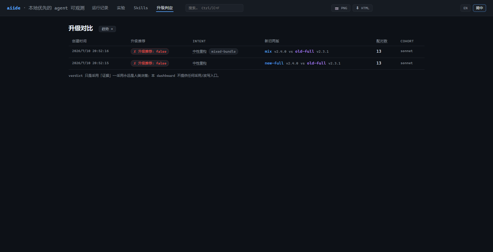

# aiide

**本地优先的 AI agent 可观测性 + 隔离式技能评测平台。**

aiide 把 AI agent 跑过的原始记录，变成可查询、可量化、可对比的证据——你能看清每一轮它读了什么、花了多少 token、触发了哪个 skill、context 怎么涨起来的；也能把一个 skill 放进隔离沙盒反复跑，用确定性的分数回答「它到底有没有用、值不值得装、哪一版更好」。

三个核心特点：

- **观测 + 评测合一**：既能事后解剖已有 session，也能主动跑受控实验打分。同一套数据模型贯穿两条路径。
- **本地优先，零上传**：所有数据只落在你机器上的 `./.aiide/` 目录，dashboard 只绑 `127.0.0.1`、全程只读。你的 code、prompt、trace 不出本机。
- **确定性、可信的分数**：能机器判定的绝不用 LLM 猜；缺数据就标 `n/a`，绝不假装成 0；估算值永远标注「估算」；分数只在可比的条件下才连线对比。

零依赖、纯 Node.js（≥20），clone 下来即可运行。

> **不只测 Claude Code。** Claude Code 是原生支持的（直接导入、直接评测）；Codex、自建 agent、HTTP 服务、纯网页产品等**任何 agent**，都能通过一个很小的适配器接进同一套评测和对比管线——见 [接入你自己的 agent](docs/guide/connect-your-agent.md)。

---

## 60 秒上手（观测你的第一个 session）

```bash
# 1. 把一段 Claude Code session 记录解析进来
node bin/aiide.js ingest <你的-claude-session-目录>

# 2. 打开本地 dashboard
node bin/aiide.js up
#    → aiide dashboard → http://127.0.0.1:4517  (local-only, read-only)
```

浏览器打开 `http://127.0.0.1:4517`，你会看到所有 session 的列表，点进任意一条就能看到逐轮的时间轴、token 花销、context 增长归因和工具调用。



> Claude Code 的 session 记录通常在 `~/.claude/projects/<项目名>/` 下（一堆 `.jsonl` 文件）。

---

## 它能帮你做什么

aiide 有两条彼此独立、又共享同一套数据模型的路径。你可以只用其中一条，也可以两条都用。

### 观测 —— 看懂 agent 到底做了什么
把已经跑完的 session 记录导入，在 dashboard 上解剖每一轮：context 怎么涨的、哪些 token 是工具结果、哪里陷入了重复循环、哪个 skill 被触发又有没有帮上忙。**零成本、零门槛，不需要任何 API key。**
→ [观测指南](docs/guide/observability.md)

### 评测 —— 给 skill 打分、比新旧版
把一个或几个 skill 放进隔离沙盒，用一份 `suite`（评测定义）反复跑同一批任务，得到带信赖区间的 C/P/R/H 分数；还能把两整包 skill 的新旧版做配对对比，给出「该不该采用」的建议和背后的统计证据。
→ [评测指南](docs/guide/skill-lab.md)

### 评测你自己的 agent —— 不限于 Claude Code
用 Codex、自建 agent、HTTP 服务或纯网页产品？写一个很小的适配器就能接进来，跑同一套分数、参与跨 runtime 对比。
→ [接入你自己的 agent](docs/guide/connect-your-agent.md)

---

## 安装与要求

- **要求**：Node.js ≥ 20。无需安装任何依赖。
- **运行方式**（任选其一）：

```bash
node bin/aiide.js <命令>      # A. 直接跑（clone 完即可用）
npm link && aiide <命令>      # B. 全局链接后用 aiide 命令
npx aiide <命令>             # C. 在项目目录内用 npx
```

> 下文命令示例统一写作 `aiide <命令>`；若你没有全局链接，把它换成 `node bin/aiide.js <命令>` 即可。

---

## 数据都在哪

所有运行期数据都写在 `--data-dir`（默认 `./.aiide/`）下，纯本地、可随时清理：

- `runs/` —— 解析后的 session
- `experiments/` —— 封存的评测结果（一旦写入不可变）
- `upgrades/` —— 升级对比报告（含单文件离线 HTML）
- `settings.json` / `pricing.json` —— 元数据默认值与成本覆写

清理只能通过 CLI：`aiide prune --older-than 30d`（默认只预览，加 `--yes` 才真删）。dashboard 没有删除接口。

---

## 一条治理原则

aiide 的所有产出都是**只读证据**。它从不回写你的 skill 或 suite，从不自动采用某个版本——采用与否永远是人的决定。dashboard 上唯一的写入是给实验加注记（annotations），且写在独立的 sidecar 文件，原始实验数据永不改动。

---

## 文档地图

**新手从这里开始：**

- [快速上手](docs/guide/getting-started.md) —— 跟着跑一遍观测和评测，各一次
- [核心概念](docs/guide/concepts.md) —— run / experiment / suite / verifier、C/P/R/H 分数、诚实披露原则

**按需深入：**

- [观测指南](docs/guide/observability.md) —— ingest / watch 与 dashboard 每个视图怎么看
- [评测指南](docs/guide/skill-lab.md) —— 写 suite、跑 lab run、读 scorecard、覆盖率统计、probe、升级对比
- [接入你自己的 agent](docs/guide/connect-your-agent.md) —— 把 Codex / 自建 CLI / HTTP / 网页产品接入评测
- [CLI 参考](docs/guide/cli-reference.md) —— 每个命令的完整语法与旗标

**深入参考：**

- [外部 runtime 接入参考](docs/adapters.md) —— adapter 逐信号完整 schema、服务生命周期、反作弊
- [aiide 操作 skill（AX）](docs/aiide-skill.md) —— 给 AI agent 读的机器语气操作手册
