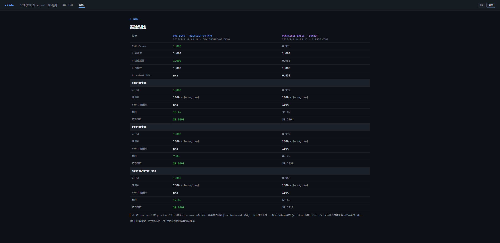

# 接入你自己的 agent（Codex / 自建 CLI / HTTP 服务 / 网页产品）

aiide 的评测**不只测 Claude Code**。任何 agent 都能接进来，跑同一套 suite、拿同一套 C/P/R/H 分数、参与同一套新旧对比和跨 runtime 比较。你的产品完全黑箱、零改动。

这份文档回答一个具体问题：**「我用的是 Codex（或自建 agent、HTTP 服务、纯网页产品），怎么把它接进 aiide 评测？」**

先说结论：

- **Claude Code 是原生支持的**——直接 `aiide ingest` / `aiide lab run`，不需要本文任何步骤。
- **其它所有 agent 通过一个「command adapter」接入**——你写一个很小的驱动程序，aiide 跑它、给它的输出打分。下面讲怎么写。

---

## 一分钟理解 adapter

一个 **adapter（驱动器 driver）** 就是一个小程序：**收一个 prompt → 调用你的 agent → 往 stdout 打印一个 JSON 对象**。就这么简单。

```
aiide  ──（prompt）──►  你的 driver  ──（调用）──►  你的 agent（Codex / CLI / HTTP / 网页）
                            │
                            └──（打印一个 JSON 到 stdout）──►  aiide 解析并打分
```

aiide 对每一次重复 spawn 一次你的 driver，读它 stdout 的那个 JSON。最小合法输出只有一个必填字段 `result`（agent 的答案）。你在 JSON 里多报一类信号，dashboard 就多亮一排统计——这是**加法式**的，从「只有答案」到「完整逐轮 trace」你自己决定接到多细。

| 你在 JSON 里报的字段 | 点亮的能力 | 不报时 |
|---|---|---|
| `result`（必填） | C 正确性、pass@k | —— |
| `trace[]`（逐轮 + 工具调用） | P/R 维度、逐轮 timeline、工具统计 | P/R 显示 n/a |
| `usage` / `total_cost_usd` | H context 健康度、token/成本统计 | H 显示 n/a |
| `triggers` | 触发率、触发覆盖 | 触发率 n/a（不惩罚） |
| `refReads` / `skills_inventory` | 参考读取覆盖及其分母 | 覆盖 n/a |
| `runtime_info` | 运行环境指纹、对比时的环境 diff | 自述 n/a |

缺任何一类信号都不会报错，只是对应的统计诚实显示 `n/a`——不会假装成 0。

---

## 三种产品形态，三种接法

| 你的 agent 是 | 接法 | 起步能拿到 |
|---|---|---|
| **CLI / 可执行程序**（如 Codex、自建 agent loop） | command adapter 直接包 | 有 trace → C/P/R；有 usage → +H |
| **HTTP / WS API 服务** | command adapter + `runtime.service` 生命周期（aiide 代管服务启停） | 同上 |
| **纯网页 UI** | Playwright driver 驱动浏览器 | 基本只有 C（completion-only） |

下面用最常见的 CLI 情形（Codex）走一遍完整流程；HTTP 服务和网页 UI 的差别只在 driver 内部怎么调用你的产品，接入 aiide 的方式完全相同。

---

## 实例：把 Codex 接进来

假设你想拿 Codex 和「Claude Code + 你的 skills」在同一批任务上比一比。四步。

### 第 1 步：写一个 driver

driver 收 prompt、调 Codex、打印 JSON。最小版本（只报答案，拿到 C 正确性）：

```js
#!/usr/bin/env node
// adapters/codex-driver.mjs — 把 Codex 包成 command adapter（最小版）
import { execFileSync } from 'node:child_process';

const prompt = process.argv[2];                      // aiide 通过 {{PROMPT}} 传进来

// ↓↓↓ 换成你的 agent 的实际调用方式（这里以 Codex CLI 无头执行为例）↓↓↓
const answer = execFileSync('codex', ['exec', prompt], { encoding: 'utf8' }).trim();

console.log(JSON.stringify({ result: answer }));     // result 是唯一必填字段
```

想拿到 P/R 和 H，就在 JSON 里多填 `trace`（逐轮和工具调用）和 `usage`（token）。一个对接真实产品、要解析工具调用和 token 的 driver 通常 100–200 行——完整字段和现成范例见 [外部 runtime 接入参考](../adapters.md)（`adapters/okx-demo-driver.mjs` 是一个真实例子）。

带 trace 和 usage 的输出长这样：

```json
{
  "result": "ETH 当前价格为 $1,999.42。",
  "total_cost_usd": 0.012,
  "runtime_version": "codex-x.y.z",
  "trace": [
    { "text": "查询行情…", "durationMs": 1200,
      "usage": { "in": 1000, "out": 50, "cacheW": 0, "cacheR": 2000 },
      "toolCalls": [ { "name": "market_price", "isError": false,
                       "input": { "symbol": "ETH" }, "result": "{\"price\":\"1999.42\"}" } ] },
    { "text": "ETH 当前价格为 $1,999.42。", "durationMs": 300,
      "usage": { "in": 1200, "out": 80, "cacheW": 0, "cacheR": 2000 } }
  ]
}
```

> 诚实提醒：某一轮拿不到 usage 就**别写那个字段**——「没报」不等于「报了 0」。aiide 会把缺席的轮记为 null，绝不折成 0。

### 第 2 步：在 suite 里声明 runtime

在 suite 顶层加一个 `runtime` 块，指向你的 driver：

```jsonc
{
  "name": "codex-vs-claude",
  "runtime": {
    "type": "command",
    "name": "codex",                                      // 显示名，出现在 scorecard / 对比里
    "cmd": "node",
    "args": ["{{SUITE_DIR}}/../adapters/codex-driver.mjs", "{{PROMPT}}"],
    "env": { }                                            // 需要的话传给 driver 的环境变量
  },
  "tasks": [
    { "id": "eth-price", "prompt": "查 ETH 现价",
      "verifiers": [ { "type": "numeric_range", "min": 100, "max": 100000 } ] }
  ]
}
```

可用占位符：`{{PROMPT}}`（当前题目）、`{{MODEL}}`（模型名）、`{{SUITE_DIR}}`（suite 文件所在目录，方便相对引用 driver）。省略 `runtime` 就是默认的 Claude Code。

> 如果你的 agent 是一个 HTTP/WS 服务，在 `runtime` 里加一个 `service` 块，aiide 会替你按模型启停这个服务、把地址通过环境变量喂给 driver（BYOK 密钥放 `.aiide/service.env`）。细节见 [adapters 参考](../adapters.md) §4。

### 第 3 步：先体检 driver，别急着跑整套

写完 driver，单发跑一次、把输出喂给 `adapter check`，确认格式没问题再跑整个 suite：

```bash
node adapters/codex-driver.mjs "查 ETH 现价" > out.json
aiide adapter check out.json           # 人读：报告哪些通道会点亮、哪里有问题
```

或者让 aiide 帮你真跑一次再校验：

```bash
aiide adapter check --suite codex-vs-claude.json --task eth-price
```

schema 违约（fatal）退出码 1；疑似笔误（warning）退出码 0 但会逐条列出。

### 第 4 步：正常跑，正常看

从这里开始，和评测 Claude Code **完全一样**——`lab run` 打分、`aiide up` 看 dashboard：

```bash
aiide lab run --suite codex-vs-claude.json --repeats 3 --concurrency 4
```

外部 runtime 里 aiide 观测不到的维度（比如它不知道你 CLI 内部的 context 组成）会诚实标 `n/a`，**绝不因此扣分**。

---

## 拿 Codex 和 Claude Code 正面比

接进来之后，你就能用同一套对比管线跨 runtime 比较——比如「自建/第三方 agent」对决「Claude Code + skills」。做法是把两边各跑成一个实验，再用对比视图并排看：

```bash
aiide up
#  打开 http://127.0.0.1:4517/#compare/<codex实验id>/<claude实验id>
```

对比会做因果门控：只有 suite 字节、模型、runtime 完全一致才算「可因果比较」，跨 runtime 天然不满足，会明确标注「仅相关」，并把两边各自观测不到的维度标 `n/a`。这样你看到的差异是真差异，不是拿苹果比橘子。



（这正是仓库里 `docs/why-self-built-agent.md` 那份「自建 agent vs 通用 agent」实测报告的产出方式——所有数字都能用 `aiide lab run` 重现。）

---

## 接下来

- 每一类信号（trace / usage / triggers / refReads / runtime_info）的完整字段、诚实降级规则、顺序语义、反作弊条款 → [外部 runtime 接入参考](../adapters.md)
- HTTP/WS 服务的 `runtime.service` 生命周期、BYOK、Playwright 网页驱动 → 同上 §4
- 接进来后怎么评测、怎么读分数 → [评测指南](skill-lab.md)
- 命令完整旗标 → [CLI 参考](cli-reference.md)
