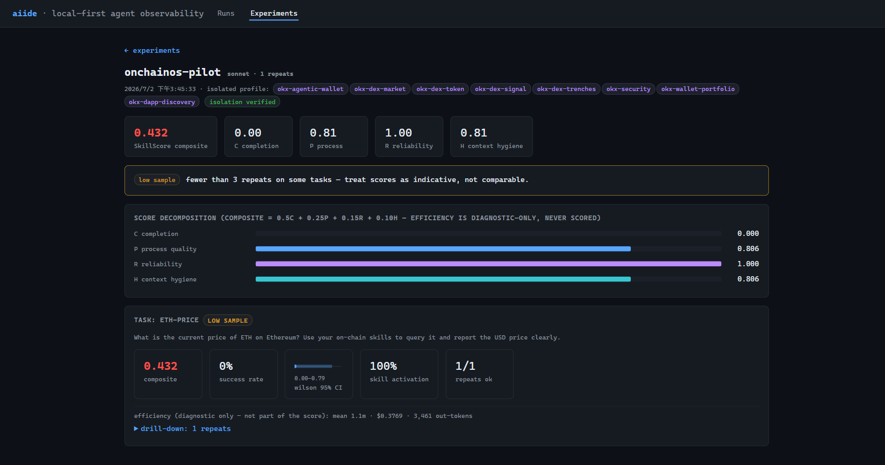

# 快速上手

这份文档带你把 aiide 的两条路径各跑一遍：先用**观测**看懂一段已有的 agent session，再用**评测**给一个 skill 打一次分。跟着做完，你就掌握了日常最常用的操作。

预计 15 分钟。观测部分不需要任何 API key；评测部分如果用现成的示例 suite，则需要被测 agent 能正常调用模型。

---

## 0. 安装与验证

要求 Node.js ≥ 20，无需安装依赖。任选一种运行方式：

```bash
# A. 直接跑
node bin/aiide.js <命令>

# B. 全局链接（之后可直接用 aiide）
npm link && aiide <命令>
```

下文统一写 `aiide <命令>`。先跑一次不带参数的命令，确认能看到帮助文本：

```bash
aiide
```

它会打印所有命令的用法总览。看到这段说明就代表装好了。

---

## 路径一 · 观测一段 session

### 第 1 步：导入 session 记录

Claude Code 会把每段会话写成 `.jsonl` 文件，通常在 `~/.claude/projects/<项目名>/` 下。把整个目录（或单个文件）喂给 `ingest`：

```bash
aiide ingest ~/.claude/projects/<项目名>
```

输出类似：

```
  ✓ 4a1c…  (12 rounds)
  ✓ 8f30…  (7 rounds + 3 sidechain)
ingested 2/2 files → .aiide/runs
```

每个文件被解析成一个 **run**，存到 `.aiide/runs/`。解析是尽力而为的——个别坏行会降级成 warning，不会中断整批。

### 第 2 步：打开 dashboard

```bash
aiide up
#  → aiide dashboard → http://127.0.0.1:4517  (data: .aiide, local-only, read-only)
```

浏览器打开 `http://127.0.0.1:4517`。首屏是 **Runs** 列表，每行一段 session，列出起始时间、模型、轮数、耗时、token 花销、成本、错误数和触发的 skill。


### 第 3 步：钻进一条 run

点任意一行进入 run 详情。这里是观测的主战场：

- **交互时间轴**：user 事件和每一轮 agent 回合交错排列，一眼看清对话怎么推进的。
- **context 增量归因**：每一轮的 context 涨了多少、涨在哪里（上一轮输出、工具结果、注入内容），压缩（compaction）也会标出来。
- **循环检测**：如果 agent 反复用同样的输入调同一个工具、或连续报错，会被标记出来。


这三样东西，就是「为什么这段 session 又慢又贵」最常见答案的所在。各视图字段的完整含义见 [观测指南](observability.md)。

### 可选：边跑边看

如果你想在 agent 还在跑的时候就实时观察，用 `watch` 尾随目录，让新回合一到就自动导入：

```bash
# 终端 A：尾随 session 目录
aiide watch ~/.claude/projects/<项目名>

# 终端 B：开着 dashboard，页面会随新回合自动刷新
aiide up
```

---

## 路径二 · 评测一个 skill

观测是事后解剖已有记录；评测则相反——你主动定义一批任务，让 agent 在隔离沙盒里反复跑，用确定性的分数回答「这个 skill 好不好用」。

### 第 1 步：生成一份 suite 骨架

**suite** 是一份 JSON，描述「用哪个模型、装哪些 skill、跑哪些任务、怎么算对」。先生成一个带注释的骨架：

```bash
aiide lab init --suite suite.json
```

打开 `suite.json`，它已经写好了可运行的示例结构（骨架里 `//` 注释是允许的）。你要改的主要是三处：

- `skills.dirs` —— 只有列在这里的 skill 目录会被装进隔离沙盒，你机器上其它 user / project 级的 skill、插件、MCP 一律不会漏进来。
- `targetSkills` —— 你期望被触发的 skill 名，它的触发情况会喂给 P / R 两个维度。
- `tasks` —— 一批任务，每个任务给一个 prompt 和若干 verifier（怎么判定答对）。

如果只是想先看看效果，仓库里 `suites/` 下有现成可跑的示例（如 `suites/okx-demo-basic.json`），可以直接拿来跑。

> 注意：示例 suite 里可能写了作者机器上的绝对路径或需要 API key 的服务配置。自己跑之前，把路径改成你本地的、把密钥换成你自己的（放在 `.aiide/service.env`，不要提交到版本库）。

### 第 2 步：跑实验

```bash
aiide lab run --suite suite.json --model sonnet --repeats 3
```

**跑得慢就开并发**：默认是串行（一次一题），一份 5 题 × 3 次重复要跑 15 次。加 `--concurrency 4` 用工作池同时跑多题，快很多——而且是安全的（每个单元独立工作区、进度日志原子写入、报错互不影响），唯一代价是会成倍地打 API，注意你的速率上限：

```bash
aiide lab run --suite suite.json --repeats 3 --concurrency 4
```

开跑前，aiide 会先打印一段 **preflight** 元数据（版本、suite 指纹、每轮预算等），让你还来得及 Ctrl-C 中止。之后逐个任务、逐次重复地跑，实时打印进度。跑完打印 **scorecard**：

```
┌─ my-suite · sonnet · 3 repeats · runtime: claude-code · skills: okx-dex-market
│ SkillScore 0.842   (C=0.89 P=0.83 R=0.78 H=0.95)
│  eth-price          composite=0.867  success=100% CI[0.44,1.00]  activation=100%  ok=3/3
│  ...
└─ efficiency is diagnostic-only; it never enters the composite score
```

**SkillScore** 是 C/P/R/H 四个维度的加权综合分。每个维度是什么、为什么效率不进综合分，见 [核心概念](concepts.md)。

实验被封存到 `.aiide/experiments/`，一旦写入不可变。中断了也不怕——再跑一次同一条命令会自动从进度日志续跑（想强制重跑加 `--fresh`）。

### 第 3 步：回 dashboard 看

跑完终端会提示一个链接：

```
view it: aiide up  →  http://127.0.0.1:4517/#experiment/<id>
```

开着 `aiide up`，打开这个链接就能看到这次实验的完整 scorecard、按分数色码排序的题目清单、覆盖率统计卡。



想在终端重看最近一次实验，直接 `aiide report`。想看这个 skill 有没有真在干活（触发率、随附文件有没有白带、外部工具覆盖），跑 `aiide stats`——这三层「怎么看结果」在 [评测指南](skill-lab.md#第三步--看结果) 里讲透了。

> **你用的不是 Claude Code？** 上面的评测同样适用于 Codex、自建 agent、HTTP 服务、纯网页产品——只要写一个很小的适配器把它接进来。见 [接入你自己的 agent](connect-your-agent.md)。

---

## 下一步

- 想真正读懂那些分数和字段 → [核心概念](concepts.md)
- 想把观测用透（每个视图、context 归因、OTel 导出）→ [观测指南](observability.md)
- 想认真做评测（写 suite、多模型对比、覆盖率统计、probe、升级对比）→ [评测指南](skill-lab.md)
- 想接入 Claude Code 以外的 agent → [接入你自己的 agent](connect-your-agent.md)
- 想查某个命令的完整旗标 → [CLI 参考](cli-reference.md)
