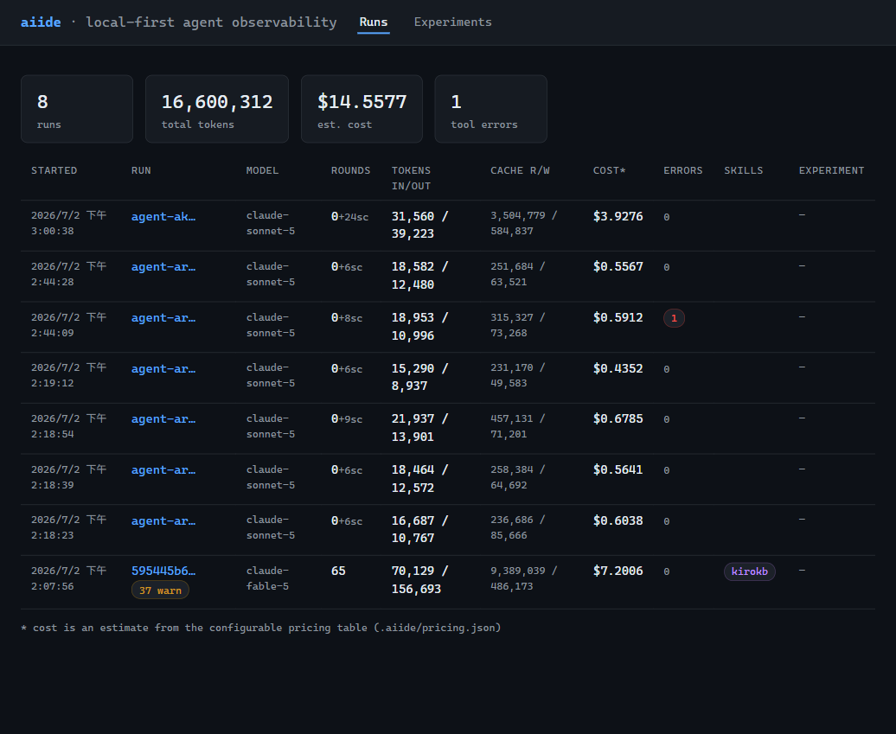
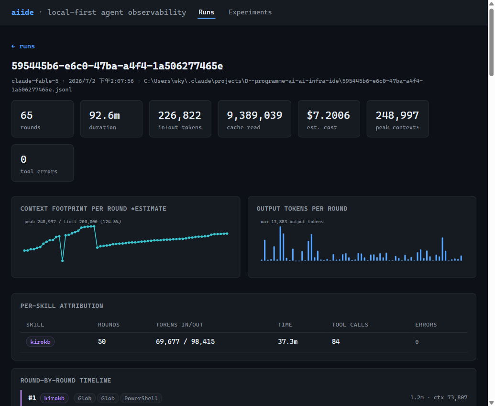
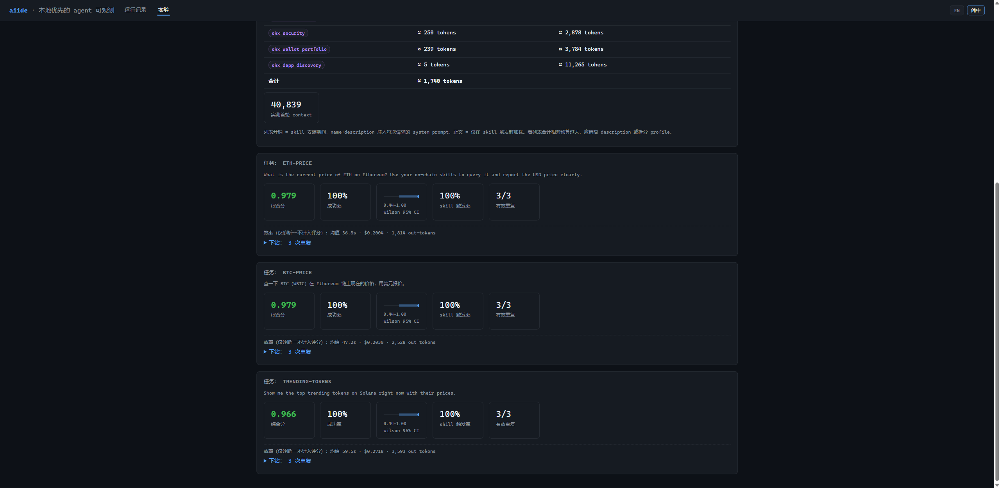
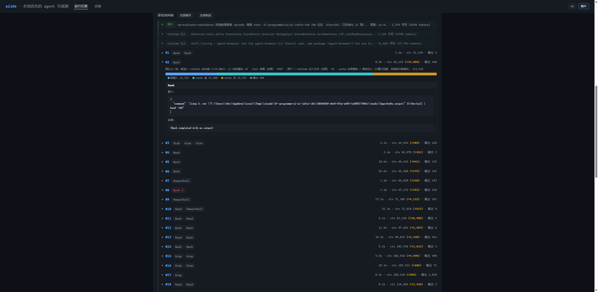

# 观测指南

这份文档讲透 aiide 的观测路径：怎么把 session 记录导进来、dashboard 上每个视图在看什么、以及怎么把数据导出到你已有的观测后端。

如果你还没跑过一遍，先看 [快速上手](getting-started.md) 的路径一；分数和字段背后的原理见 [核心概念](concepts.md)。

---

## 导入数据：ingest 与 watch

### aiide ingest —— 一次性导入

```bash
aiide ingest <目录|文件.jsonl>
```

- 给**目录**就递归找里面所有 `.jsonl` 文件；给**单个文件**就只导那一个。
- 每个文件解析成一个 **run**，写到 `.aiide/runs/<id>.json`。
- run 的 id 取自**文件名**，不是记录里的 sessionId。原因是：主 session 和它派生的 subagent（sidechain）记录会共用同一个 sessionId，用 sessionId 当唯一键会让它们互相覆盖。
- 解析是尽力而为的：坏行降级成 warning，不中断整批。输出会告诉你每个文件解析出多少轮、多少 sidechain 轮、多少 warning。

Claude Code 的 session 记录通常在 `~/.claude/projects/<项目名>/` 下。

### aiide watch —— 实时尾随

```bash
aiide watch <目录|文件.jsonl>
```

用文件轮询（约 500ms）盯住目录，session 一有新回合就重新导入。它和 dashboard 是零耦合的：`watch` 只负责写 run JSON，`aiide up` 自己会察觉文件变化，通过 SSE 把更新推给浏览器。

典型用法是两个终端并行——一个 `watch` 尾随，一个 `up` 开着页面，agent 边跑你边看。按 Ctrl-C 停止尾随。

---

## Dashboard 视图

`aiide up`（默认 `http://127.0.0.1:4517`）打开后有两个顶层标签页：**Runs** 和 **Experiments**。全站只读，任何非 GET 请求都会被拒（唯一例外是给实验加注记）。下面逐个视图讲。

### Runs 列表

所有导入的 session，一行一段。关键列：

- **起始时间 / 模型 / 轮数（rounds）** —— 这段会话什么时候跑的、用什么模型、来回了几轮。
- **token 四桶** —— 输入、输出、缓存读、缓存写分开列。缓存读写单独看，能判断 prompt 缓存有没有生效。
- **成本** —— 按 token 和定价估算的美元数（定价可用 `.aiide/pricing.json` 覆写，支持非 Claude 模型）。
- **错误 / 技能 / 所属实验** —— 错误率概览、这段触发了哪些 skill、以及它属不属于某次实验。



页面上还有一个 `prune` 提示：它只给你一条可复制的清理命令，**不会**帮你删任何东西——保留操作永远走 CLI。

### Run 详情

点进任意一段 run，这是观测最有价值的地方。



**交互时间轴**：把 user 事件和每一轮 agent 回合按顺序交错排开，你能顺着看完整段对话是怎么推进的——哪一轮读了文件、哪一轮调了工具、哪一轮在等你确认。

**context 增量归因**：这是 aiide 最独特的视图之一。每一轮的 context 涨了多少，会被拆解归因到几个来源：

- **上一轮输出（prevOut）** —— 精确值。
- **工具结果 / 注入内容（toolRes、injected）** —— 估算值，明确标注为估算。
- **负残差 = 压缩（compaction）** —— 如果某轮 context 不升反降，说明发生了压缩，堆叠图会把这部分画在基线下方。



「这段 session 为什么越跑越贵」的答案，通常就藏在这张图里——是工具结果太占地方，还是每轮都在重复背同样的 context。



**确定性循环检测**：如果 agent 用**完全相同的输入**反复调同一个工具，或者连续报错达到一定次数（≥4），会被标记为循环。这是纯确定性的判定，不靠猜——帮你一眼揪出卡住空转的地方。

**per-skill 表**：这段 session 里每个 skill 的触发情况和占用。

### 全文搜索

顶部搜索框（或 `#search/<关键词>`）会对所有 run 的 JSON 做全文 grep，快速定位「哪段 session 里出现过某个报错/某个工具/某个词」。

---

## Experiments 相关视图

Experiments 标签页列出所有评测实验，也是 skills 和 upgrades 子视图的入口。这些视图属于评测路径，详细讲解在 [评测指南](skill-lab.md)，这里只说它们同样遵守观测的诚实规则：degraded 状态会打徽章、统计数字带「权威（封存）/ 回填（非权威）」标记、不可比的对比明确标注。

---

## 导出到 OTel 后端

如果你已经有一套基于 OpenTelemetry 的观测后端，可以把 aiide 的数据吐过去：

```bash
aiide export --otel <run或experiment的id> --out run.otlp.json
```

导出的是 OTLP/JSON 格式，遵循 OTel GenAI 语义约定（semantic conventions），零 SDK 依赖手写生成。不带 `--out` 就直接打到标准输出，方便接管道。

这条路径让 aiide 既能当独立的本地工具，也能作为数据源接进你现有的可观测性体系。

---

## 相关文档

- 命令的完整旗标 → [CLI 参考](cli-reference.md)
- 分数和字段的原理 → [核心概念](concepts.md)
- 观测「什么该被观测」的完整分类法（内部设计）→ `../observability-taxonomy.md`
