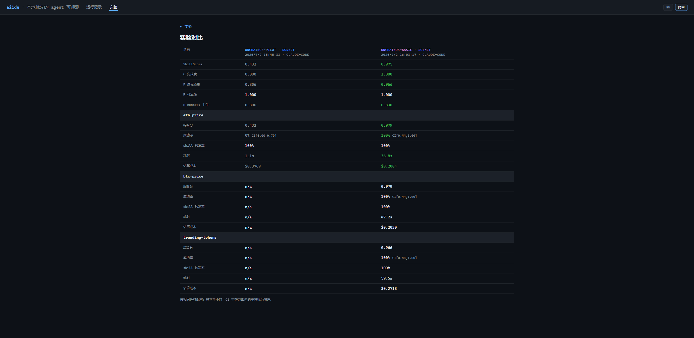

# 评测指南

评测就做一件事：**用一份固定的题目，把一个 skill 反复跑很多次，用确定性的分数告诉你它到底好不好用。**

整个流程只有三步，这份文档按这三步展开，读完你能独立完成一次完整评测并看懂全部结果：

```
第一步 写 suite  →  第二步 跑 suite  →  第三步 看结果
（定义题目）        （lab run）         （scorecard + 覆盖率 + dashboard）
```

后半段是进阶内容（probe、judged 评分、升级对比、接外部 runtime），用到再看。分数背后的原理见 [核心概念](concepts.md)。

---

## 第一步 · 写一份 suite

**suite** 是一份 JSON，描述一次评测：用哪个模型、装哪些 skill、跑哪些任务、每个任务怎么算对。先生成一个带注释的骨架：

```bash
aiide lab init --suite suite.json          # 文件已存在则加 --force 覆盖
```

打开生成的 `suite.json`，你主要改三个地方：

```jsonc
{
  "name": "my-suite",           // 实验 id 和续跑日志的键由它派生
  "model": "sonnet",
  "repeats": 5,                 // ≥3，Wilson 信赖区间才可信

  "skills": { "dirs": ["./skills/okx-dex-market"] },  // ← 改这里：只装这些 skill
  "targetSkills": ["okx-dex-market"],                 // ← 改这里：期望被触发的 skill

  "tasks": [                                          // ← 改这里：题目
    { "id": "eth-price", "prompt": "查 ETH 现价",
      "verifiers": [ { "type": "numeric_range", "min": 100, "max": 100000 } ] }
  ]
}
```

- **`skills.dirs`** —— 隔离的关键。aiide 用一个专属的 `CLAUDE_CONFIG_DIR`，**只装**这里列出的 skill；你机器上 user 级、project 级的其它 skill、插件、MCP 一律不会漏进来。每次重复还跑在全新的空工作区里。这样分数只归因于你要测的东西，不被环境污染。
- **`targetSkills`** —— 你期望被触发的 skill 名，它的触发情况喂给 P / R 维度。
- **`tasks`** —— 一批题目，每题一个 prompt 加若干 verifier。

suite 允许写 `//` 和 `/* */` 注释。完整字段表见 [CLI 参考](cli-reference.md#suite-字段)；不想从头写就直接拿 `suites/` 下的现成示例改。

### 怎么判定「答对」：verifier

一个任务的**所有** verifier 全过，这一次才算 C=1（正确）。四种 verifier：

| 类型 | 字段 | 通过条件 |
|---|---|---|
| `regex` | `pattern`, `flags?`, `expect?` | 答案匹配正则（`expect:false` 则要求不匹配）。 |
| `numeric_range` | `min`, `max` | 答案里出现一个落在 `[min,max]` 的数。 |
| `json_field` | `path`（点路径） | 答案能解析成 JSON，且该路径非空。 |
| `file_exists` | `path`, `schema?` | 工作区里生成了该文件；带 `schema.required` 时它须是含这些字段的 JSON。 |

### 多步任务

一个任务能拆成多步，共享同一个工作区（文件在步骤间保留）：

```jsonc
{ "id": "flow", "minReward": 1, "steps": [
  { "prompt": "第一步：抓数据写 out/data.json", "verifiers": [ { "type": "file_exists", "path": "out/data.json" } ] },
  { "prompt": "第二步：用 out/data.json 回答",   "verifiers": [ { "type": "regex", "pattern": "done" } ] }
] }
```

某步通过比例低于 `minReward`（默认 1）时，后续步骤中止并记录 `abortedAtStep`。只有每步都跑到且 verifier 全过，整个任务才 C=1。

---

## 第二步 · 跑 suite

```bash
aiide lab run --suite suite.json --model sonnet --repeats 3
```

开跑前 aiide 先打印一段 preflight 元数据（版本、suite 指纹、预算），让你还来得及 Ctrl-C。之后逐题逐次跑，实时打印进度，跑完打印 scorecard（下一步详解）。实验封存到 `.aiide/experiments/<id>.json`，不可变。

### 推荐：用 `--concurrency` 并行加速

默认是**串行**（一次跑一题），稳妥但慢——一份 5 题 × 3 次重复的 suite 要跑 15 次。**如果你不受 API 速率限制困扰，强烈建议开并发**：

```bash
aiide lab run --suite suite.json --repeats 3 --concurrency 4
```

`--concurrency N` 用一个宽度为 N 的有界工作池同时跑多题，墙钟时间大幅缩短。它是**安全的**——这不是「能跑但有风险」，而是设计上就没有共享可写状态：

- 每个「题×重复」单元有**独立的工作区目录**，互不踩文件；
- 进度日志用操作系统级的**原子追加**写入，并发下不会丢信号（中断了照样能续跑）；
- 结果按输入顺序回填，**完成先后不影响评分**；
- 单个单元报错被隔离，不会中断整批。

唯一的代价是**它会 N 倍地打 API**——所以选 N 时看你的速率上限，别一上来就开很大。默认保持串行只是为了稳妥，不是因为并行不可靠。

### 多模型对比

```bash
aiide lab run --suite suite.json --models sonnet,opus
```

同一份 suite 每个模型各跑一遍，跑完自动打印**配对对比**（相同题目上并排比 composite / 成功率 / 耗时 / 成本），并给一个 `#compare/...` 链接。

### 续跑与重来

实验被中断后，**再跑一次同一条命令**会自动从进度日志接着跑，告诉你还剩几次——不用担心白跑。想强制从头重来才加 `--fresh`。

---

## 第三步 · 看结果

结果有三个层次，从粗到细：**终端 scorecard**（一眼看好坏）→ **覆盖率统计**（看 skill 有没有真在干活）→ **dashboard**（图形化钻取）。

### 3.1 终端 scorecard

跑完立刻打印，也能随时 `aiide report [experimentId]`（不给 id 就是最近一次）重看：

```
┌─ my-suite · sonnet · 3 repeats · runtime: claude-code · skills: okx-dex-market
│ SkillScore 0.842   (C=0.89 P=0.83 R=0.78 H=0.95)
│  eth-price          composite=0.867  success=100% CI[0.44,1.00]  activation=100%  ok=3/3
│                     diag: 4.2s · $0.031 · 1820 out-tok · pass@1=0.87 pass@3=1.00
│                     activation×outcome: triggered → 0.87 (n=3) · never not-triggered
└─ efficiency is diagnostic-only; it never enters the composite score
```

一行行读：

- **表头** —— suite 名、模型、重复次数、runtime、装了哪些 skill。
- **`SkillScore`** —— 综合分，括号里是 C/P/R/H 四维拆解（含义见 [核心概念](concepts.md)）。可能带 `(partial dims)`（部分维度缺）或 `⚠ low sample`（样本太少）。
- **每题一行**：
  - `composite` —— 该题综合分。
  - `success=100% CI[0.44,1.00]` —— 成功率，以及它的 Wilson 信赖区间（真实成功率大概率落在这个范围。样本少时区间会很宽，别把窄样本的高分当定论）。
  - `activation=100%` —— 期望 skill 的触发率。
  - `ok=3/3` —— 通过数 / 有效样本数。
- **`diag:` 行** —— 平均耗时、成本、输出 token、pass@k。**全是诊断信号，不进综合分**（一个又快又便宜但答错的 skill 不该因效率高而得高分）。
- **`activation×outcome`** —— 触发 skill 时的平均 C vs 没触发时的平均 C，回答「触发这个 skill 到底有没有帮上忙」。低样本会标 correlational。
- **degraded** —— 如果有重复因环境噪声被剔除，会单独打一行说明剔了几个、噪声是什么，分数只算有效样本。

### 3.2 覆盖率统计：`aiide stats`

scorecard 告诉你「答对没」，覆盖率统计告诉你**「skill 有没有真在干活、随附文件有没有白带、外部工具覆盖到什么程度」**。这是判断一个 skill「值不值得装」的关键。

```bash
aiide stats [experimentId]              # 打印统计
aiide stats <id> --write                # 存到 .aiide/stats/<id>.json
```

**先看分母**。输出开头是一组样本分桶，覆盖率的分母**永远是 `nCoverageValid`**（成功解析出记录的有效样本），不是 scorecard 里的 `n`（那个把超时失败也算进去了）。分桶：

| 字段 | 含义 |
|---|---|
| `nCoverageValid` | 覆盖率统计的**唯一合法分母** |
| `nExcluded` | 因环境噪声被排除的样本 |
| `noSession` | 根本没跑出 session（如超时，连触发都没到） |
| `nUnresolved` | 记录被 prune 删了、解析不到 |
| `heldOutExcluded` | 保留题，不进任何统计 |

**各节含义**（不可知的节统一显示为 `null` + 原因，绝不假装成 0）：

- **skillCoverage** —— 装的 skill 各自被触发到什么程度。两个要认清的状态：
  - `neverTriggered`（**有题考它、却一次没触发**）→ 真正的**死重候选**，白占 context。
  - `notExercised`（**根本没有题考它**）→ 没给出场机会，**不算死重**。
- **refCoverage** —— 每个 skill 随附的 reference 文件，有没有在有效运行里被读到。从没被读的进 `unreadRefs`，是**死重候选**（可能可以删）——但会先排除三种豁免：只在被拒权限的运行里读过、只在被排除的运行里读过、所属 skill 从没触发。可知性由 `inventoryStatus` 决定（有快照才能知道「出货了多少」；外部 runtime 自管 skill 则这一节为 null）。
- **probes（外部工具三种信号）** —— 需要先配置 probe（见下文进阶节）。三个信号：命令面覆盖（实际调的子命令 / probe 声明的命令面）、按 skill 的命令共现、相邻命令的 n-gram 序列（**永远只是「假说」，不是采用建议**）。probe 在场却零命中会标 `suspect`（多半是 pattern 写错）。
- **proximity** —— 同一次运行里「A 之后紧接着 B」的时序邻近图。全部标注「**时序邻近，非因果**」，不是采用信号。
- **其余诊断节**（各一句）：`contextComposition`（最终 context 是怎么一块块堆起来的）、`toolUsage`（工具调用按类型分桶、主 vs sidechain）、`truncation`（多少回合被 max_tokens 截断）、`fileTargets`（读写落在 skill 参考 / 工作区 / 其它）、`cacheHitRate`（每回合缓存命中率）、`selfReport`（runtime 自报的成本/轮数/耗时）、`sidechainShare`（子代理占的 token 份额）、`statsHealth`（观测管线自身健康：排除、超时、重试成功、verifier 失败 top10）。

**权威规则**：封存实验内嵌的统计是唯一权威，默认直接打印；`--force` 从记录重算但会标记为**非权威**；`--write` 存 sidecar，绝不改动实验本身。

### 3.3 Dashboard 实验详情页

开着 `aiide up`，打开跑完时提示的 `#experiment/<id>` 链接，看图形化版本：


- **色码题目清单** —— 每题一行，按 composite **从低到高排序**（红色的失败题聚在最上方，最该关注的先看到）。分数 0→1 映成红→绿；答错（C=0）强制红色；无数据显示中性灰，不假装成绿色。
- **统计卡** —— 上面那些覆盖率节的图形版。没有统计时提示你跑 `aiide stats` 回填。
- **权威徽章** —— 每块数据标明来源：`权威（封存时计算）` 还是 `回填（非权威）`，让你知道数字可信到什么程度。块级状态一律用**文字徽章**（`样本不足` / `不可用` / `可疑` / `留出未知` / `正常`），从不用一个会误导的比率数字。

---

## 进阶 · probe：让 aiide 看懂外部工具调用

如果你的 skill 会调外部 CLI（如某个 `onchainos` 命令）或 MCP 工具，aiide 默认只知道「调了一个工具」，不知道「调了哪个子命令」。**probe** 就是补上这层理解的配置——它是一份声明式 JSON 适配器，告诉 aiide：哪个工具调用承载了一次外部调用、怎么从命令行里抽出子命令。上面 3.2 的 probes 信号全靠它。

- **放哪**：`<data-dir>/probes/*.json`。没有这个目录 = 没配 probe，完全合法。
- **suite 白名单**：suite 里写 `"probes": ["onchainos"]`，只有 tool 名在列表里的 probe 会生效。
- **schema**：字段 `tool`（必填）、`match`（必填）、`commandSurface`、`sequences`、`capabilities`。任何拼错的字段或编译不了的正则会在加载时直接报错——宁可不加载，也不加载一个悄悄出错的 probe。

一个真实的 Bash CLI probe（`test/fixtures/probes/onchainos.json`）：

```json
{
  "tool": "onchainos",
  "match": {
    "toolName": "Bash",
    "commandPattern": "(?:^|[;&|]\\s*)onchainos\\s+([a-z][\\w-]*)(?:\\s+([a-z][\\w-]*))?"
  },
  "commandSurface": { "source": "static", "commands": ["price get", "order create", "balance"] },
  "sequences": [ { "pattern": ["price get", "order create"], "singleCommand": "order create --with-price" } ]
}
```

- `match.toolName: "Bash"` + `commandPattern` —— 从 Bash 命令行里抽子命令（复合命令会按 `; && || |` 切段各自匹配）。
- MCP 工具族则用 `match.toolNamePattern: "^mcp__onchainos__(.+)$"`（第一个捕获组就是子命令）。
- `commandSurface.commands` —— 你声明这个工具「总共有哪些命令」，用来算命令面覆盖率。

---

## 进阶 · judged 评分与无人值守

有些答案没法用正则/数值判定（比如自然语言质量）。让 LLM 当裁判：

```bash
aiide lab run --suite suite.json --grading-authority judged --judge-model haiku
```

judge 用 temperature 0 + 结果缓存 + 多票多数决，且**和确定性 C 隔离**——只有明确开了 judged 权威时它才参与判定 C。

被测任务中途会弹交互确认（确认 / 询问用户 / 权限）时，用 responder 自动回答，让评测无人值守：

```bash
aiide lab run --suite suite.json --responder scripted     # 策略：scripted / policy / judge
```

---

## 进阶 · skill 作为一等公民

```bash
aiide skill            # 所有 skill：版本数、触发率、平均分
aiide skill <name>     # 单个 skill 的版本时间线 + 分数趋势
```

跨实验汇总一个 skill 的表现。最有用的一条信号是 **never triggered**——装了却从没触发的 skill 是纯 context 税，会被明确标出。分数趋势只在**同一个可比性 cohort 内**连线（同 suite·model·runtime），跨 cohort 的点单独列，不连成误导性曲线。

---

## 升级对比：两版 skill 谁更好

改了一整包 skill，想知道「新版该不该采用」，用 upgrade 管线。它把**新旧两个 arm** 放在同一批、按 case-id 配对的题目上跑，给出**采用建议（verdict）**加背后的统计证据。

```bash
aiide upgrade lint      --suite <f>                    # 跑前数据集静态检查
aiide upgrade preflight --fixture <m>                  # 零 token 静态门，fatal 即非零退出
aiide upgrade compare   --fixture <m> --intent <i>     # 配对，跑 verdict 引擎
aiide upgrade report    --fixture <m>                  # 产出 report.json + .md + .html
aiide upgrade smoke     --mix a=new,b=old --fixture <m>  # 混搭确认冒烟（唯一被认可的手挑混搭采用路径）
```

- **verdict 五种**：`cost-opt`（省成本）/ `quality-fix`（提质量）/ `neutral-refactor`（中性重构）/ `insufficient-data`（数据不足）/ `inconclusive`（不确定）。后两种绝不会被渲染成「否决」——数据不够就诚实说不够。
- **`--intent`** 参数化裁决门槛（你想优化什么，门槛就按什么调）。
- 跑前先打印 **U0 预算表**（sessions × repeats × 估算美元 + ETA），让你花钱前能 Ctrl-C。

### 怎么读升级报告

`report` 一次产出三件工件到 `.aiide/upgrades/<compare-id>/`，一次写定、不可变（重跑生成新 id）：

- **`report.html`（推荐从这里看）** —— **单个离线 HTML 文件**，把图表库整个内嵌进去，零外部请求、可直接分享。浏览器打开就能看：顶部 sticky 判定条，左侧锚点导览 `S1 判定 / S2 质量三层 / S3 成本三轴 / S4 依赖图 / S5 证据 / S6 环境足迹 / S7 外部探针 / S8 覆盖统计 / S9 运行时自述`，配 CI 柱状图、依赖图、热力图等。术语有虚线下划线，悬停看解释。
- **`report.md`** —— 纯文本版，用编号标题方便检索：`## 1. Verdict`（判定就是第一章）、`## 2. Quality`、`## 3. Cost`、`## 4. Depgraph`、`## 5. Evidence`、`## 6. Footprint`、`## 7. Diff`，之后动态接覆盖统计对比、运行时自述对比。
- **`report.json`** —— 给程序/AI 读，**第一层就是判定**（`verdict` / `established` / `intent`），再往下是配对数、排除率、两 arm 版本、各质量与成本轴的数字。字段清单见 `../aiide-skill.md`。

dashboard 上 `#compare/<A>/<B>` 做两实验的 1v1 对比，`#upgrades` 看 verdict 卡。对比会做因果门控：只有 suite 字节 + 模型 + runtime 全同才算可因果比较，否则明确标「仅相关」。



同一套管线也能跨 runtime 对比（比如自建 agent vs Claude Code + skills），不能比的维度诚实标 `n/a` 而非罚分。


> **实现现状**：上面 `run/compare/report/smoke` 的离线管线目前通过 `--fixture <module>`（合成 bundle）驱动，供离线/端到端测试用；采集真实 session 需 live claude runtime。以 `aiide`（无参数）打印的帮助文本为准。

---

## 评测 Claude Code 以外的 agent

上面所有内容默认被测的是 Claude Code。但同一套评分和对比管线也能测**任何** agent——Codex、自建 CLI、HTTP 服务、纯网页产品——只要写一个很小的适配器把它接进来。接进来之后，写 suite、跑 lab run、读 scorecard、升级对比、跨 runtime 比较，全都一样。

完整走一遍（含 Codex 接入实例）→ [接入你自己的 agent](connect-your-agent.md)。

---

## 相关文档

- 命令完整旗标 → [CLI 参考](cli-reference.md)
- 分数原理 → [核心概念](concepts.md)
- 接入 Claude Code 以外的 agent → [接入你自己的 agent](connect-your-agent.md)
- 给 AI 读的操作手册（含 report.json 该读哪些 key）→ `../aiide-skill.md`
- adapter 逐信号完整 schema → `../adapters.md`
